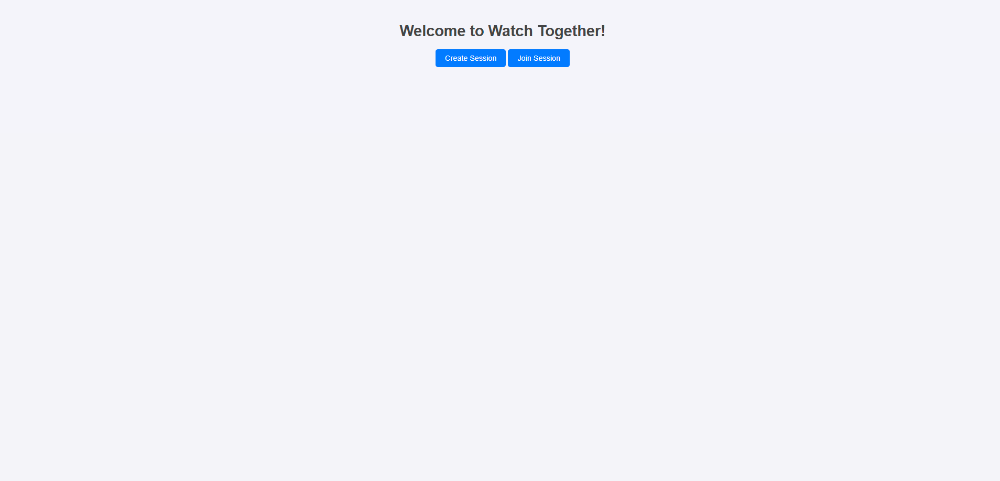
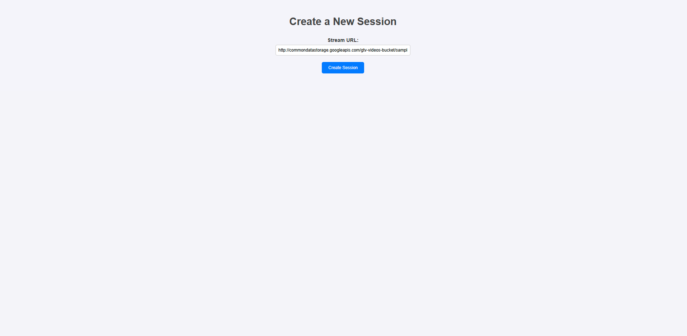
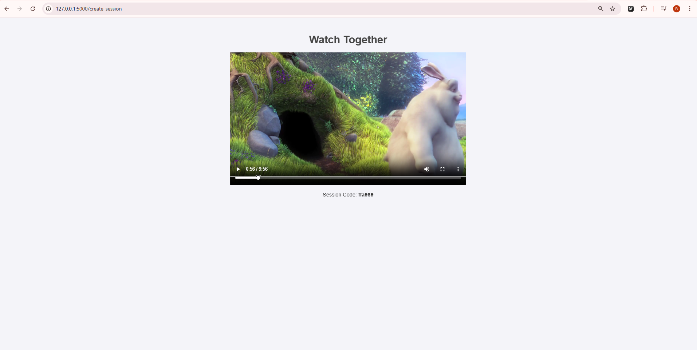
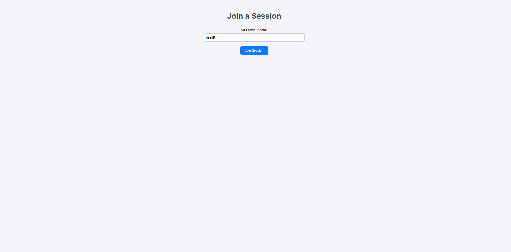
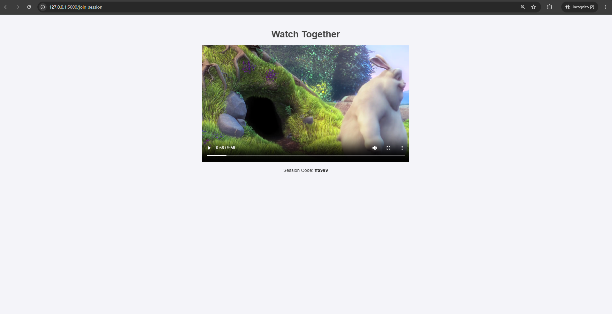

## **Watch Together 🎥**

A simple Flask-based web application that allows you to **watch movies together with friends** in perfect synchronization. The app uses a session-based approach where one person acts as the "admin" and controls the video, while friends join the session and have their video players synchronized in real time.

---

## **Features 🚀**

- 🎬 **Synchronized Video Playback**: The admin's video position (play, pause, seek) is synchronized across all participants.
- 🔗 **Session-Based Control**: Generate a unique session code to share with friends.
- 📡 **Real-Time Sync**: Video synchronization happens every **1 second** using polling.
- 🌐 **User-Friendly Interface**: Clean and modern UI with intuitive navigation.
- 🐳 **Dockerized**: Deploy the app easily using Docker and Gunicorn for production readiness.

---

## **Tech Stack 🛠️**

- **Backend**: Flask
- **Frontend**: HTML, CSS, JavaScript
- **Server**: Gunicorn
- **Containerization**: Docker

---

## **Screenshots 📸**

### **Home Page**


### **Create Session**



### **Join Session**


### **Watch Together**


---

## **Setup Instructions 🛠️**

Follow these steps to set up the project on your local machine:

### **1. Clone the Repository**
```bash
git clone https://github.com/yourusername/watch-together.git
cd watch-together
```

---

### **2. Install Dependencies**

Make sure you have Python **3.10+** installed.

```bash
pip install -r requirements.txt
```

---

### **3. Run the App Locally**

Start the Flask development server:

```bash
python app.py
```

Visit `http://127.0.0.1:5000` in your browser.

---

## **Docker Deployment 🐳**

The app is Dockerized and uses Gunicorn for production.

### **1. Build the Docker Image**

```bash
docker build -t watch-together .
```

---

### **2. Run the Container**

```bash
docker run -p 8000:8000 watch-together
```

---

### **3. Using Docker Compose**

Alternatively, use Docker Compose for easier deployment:

```bash
docker-compose up --build
```

Access the app at `http://127.0.0.1:8000`. (Expose it to public url to share with your friends. You can use ngrok, cloudflare tunnels, tailscale or even use portforwading for the same.)

---

## **Usage Instructions 🎥**

1. **Home Page**: Choose to "Create Session" or "Join Session".
2. **Create Session**:
   - Enter the stream URL (e.g., from your Jellyfin server).
   - A unique session code will be generated.
   - Share the code with your friends.
3. **Join Session**:
   - Enter the session code shared by the admin.
   - The video will play in sync with the admin.
4. **Watch Together**:
   - The admin controls the video (play, pause, seek).
   - All participants' video players stay synchronized.

---

## **Folder Structure 📁**

```
watch-together/
│
├── app.py                   # Flask application
├── Dockerfile               # Dockerfile for production
├── docker-compose.yml       # Docker Compose configuration
├── requirements.txt         # Python dependencies
├── templates/               # HTML templates
│   ├── home.html
│   ├── create_session.html
│   ├── join_session.html
│   └── watch.html
└── static/                  # Static files
    ├── styles.css           # CSS for styling
    └── sync.js              # JavaScript for video synchronization
```


## **Contributing 🤝**

Contributions are welcome! If you'd like to improve the app, feel free to fork the repository, create a new branch, and submit a pull request.

---

## **License 📄**

This project is licensed under the **MIT License**. See the [LICENSE](LICENSE) file for details.

---

## **Contact 📧**

- **Author**: Rahul Vijayakumar  
- **GitHub**: [rahulvk007](https://github.com/rahulvk007)  
- **Email**: [mail@rahulvk.com](mailto:mail@rahulvk.com)

---

Enjoy watching movies with your friends, no matter where you are! 🎉